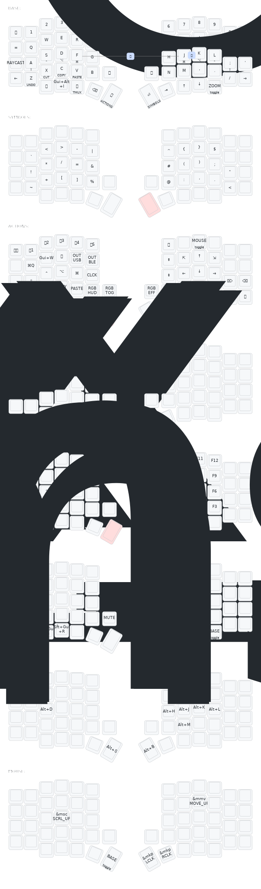

# ZMK Config

## Keymap

## Resources

- [folke](https://github.com/folke/zmk-config)
- [urob](https://github.com/urob/zmk-config): timeless home row mods
- [infused-kim](https://github.com/infused-kim/zmk-config)
- [miryoku_zmk](https://github.com/manna-harbour/miryoku_zmk)
- [ZMK Docs](https://zmk.dev/docs)
- [Designing a Symbol Layer](https://getreuer.info/posts/keyboards/symbol-layer/index.html)
- [A guide to home row mods](https://precondition.github.io/home-row-mods#shift-thumb-keys)
